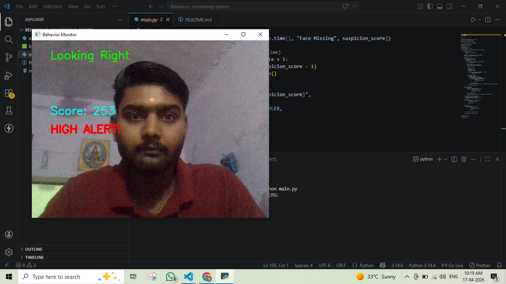
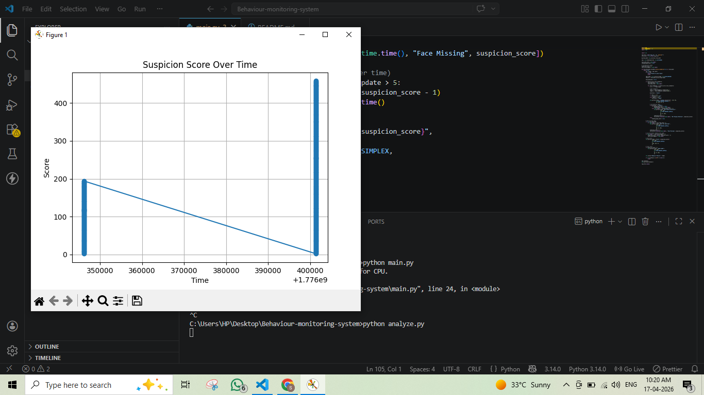

# AI-Based Behavioral Monitoring System





## 📌 Overview
This project is an AI-based system that monitors user behavior using computer vision. It detects attention patterns, tracks face presence, and identifies anomalies like inattentiveness.

---

## 🚀 Features
- Face Detection (real-time)
- Eye Tracking (left/right/center)
- Attention Monitoring (time-based)
- Suspicion Scoring System
- Event Logging (CSV)
- Data Visualization (graphs)

---

## 🧠 How It Works
1. Captures webcam input
2. Detects face and eye landmarks
3. Tracks eye direction
4. Applies time-based logic to detect inattentiveness
5. Assigns suspicion score
6. Logs events and visualizes behavior

---

## 🛠️ Tech Stack
- Python
- OpenCV
- MediaPipe
- Matplotlib

---

## ▶️ How to Run

### Step 1: Install dependencies
```
pip install -r requirements.txt
```

### Step 2: Run main system
```
python main.py
```

### Step 3: Analyze data
```
python analyze.py
```

---

## 📊 Output
- Real-time monitoring window
- Alerts for inattentive behavior
- `log.csv` file for data logging
- Graph visualization of suspicion score

---

## 💡 Key Innovation
This system uses a **rule-based scoring mechanism** instead of simple detection, allowing it to analyze behavior patterns over time.


## 💡 Important Note!!! 
Built with the assistance of AI tools, with custom system design and behavior logic implemented independently.
---

## 👨‍💻 Author
Siddhant Kumar Singh
